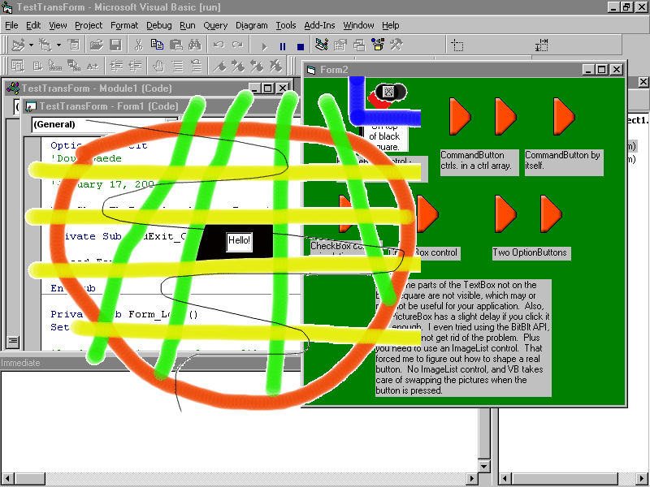



## Form, CommandButton, CheckBox, OptionButton, PictureBox any shape& transparent \(ver\. 3\.2 final\)

### Description

Version 3.2 of the code I posted on 2000-10-31 and updated several times. This post fixes the final bugs so the buttons look perfect when pushed, and no more code kludges are necessary. As before, even faster than version 2. Will draw a complex form in ~.007 of a second compared to the time for the pre-version 1 code of ~27.0 seconds. Like before, it accepts a Form, CommandButton, CheckBox, OptionButton or PictureBox and shapes it to the image assigned to the Picture property. This includes making a specified color completely transparent (you can click on objects underneath the form) during the shaping process. This is a major expansion on code submitted by Chris Yates. Now you can make specially-shaped controls using a PictureBox or real buttons. Full examples given, and well-commented code.
 
### More Info
 

             |
---                |---
**Submitted On**   |2001-01-17 15:48:10
**By**             |[Doug Gaede](https://github.com/Planet-Source-Code/PSCIndex/blob/master/ByAuthor/doug-gaede.md)
**Level**          |Intermediate
**User Rating**    |4.7 (104 globes from 22 users)
**Compatibility**  |VB 5\.0, VB 6\.0
**Category**       |[Graphics](https://github.com/Planet-Source-Code/PSCIndex/blob/master/ByCategory/graphics__1-46.md)
**World**          |[Visual Basic](https://github.com/Planet-Source-Code/PSCIndex/blob/master/ByWorld/visual-basic.md)
**Archive File**   |[CODE\_UPLOAD138621172001\.zip](https://github.com/Planet-Source-Code/doug-gaede-form-commandbutton-checkbox-optionbutton-picturebox-any-shape-transparent-ver-3__1-14482/archive/master.zip)

